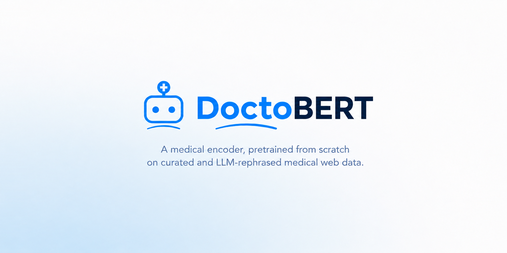

# DoctoBERT

<center>
  
</center>

<p align="center">
<a href="https://huggingface.co/blog/bofenghuang/doctobert-fr-release">🤗 Blog</a> |
<a href="https://github.com/doctolib-lab/doctobert">💻 Code</a> |
<a href="https://huggingface.co/collections/doctolib-lab/finemed-fr">🌐 FineMed</a> |
<a href="https://huggingface.co/collections/doctolib-lab/doctobert-fr">🩺 DoctoBERT</a>
</p>

<!-- Banner with Technical Report (restore once the arXiv ID is available):
<p align="center">
<a href="https://huggingface.co/blog/bofenghuang/doctobert-fr-release">🤗 Blog</a> |
<a href="https://arxiv.org/abs/2606.XXXXX">📄 Technical Report</a> |
<a href="https://github.com/doctolib-lab/doctobert">💻 Code</a> |
<a href="https://huggingface.co/collections/doctolib-lab/finemed-fr">🌐 FineMed</a> |
<a href="https://huggingface.co/collections/doctolib-lab/doctobert-fr">🩺 DoctoBERT</a>
</p>
-->

*DoctoBERT* is a family of medical encoders, pretrained from scratch on medical text curated from the open web, which provides the scale, source, and stylistic diversity that hand-curated corpora lack.

This repository holds the **reproducible data-curation pipeline**, which combines two complementary levers: **multi-axis annotation** that scores each document along three axes (subdomain, educational quality, and medical-term density) to select the documents most valuable for pretraining, and **signal-amplifying rephrasing** that uses an LLM to rewrite documents into denser variants with broader entity contexts to improve their training utility. Model pretraining builds on the [ModernBERT](https://github.com/AnswerDotAI/ModernBERT) codebase, included here as the `ModernBERT/` submodule.

## Installation

Clone with the `ModernBERT` submodule:

```bash
git clone --recurse-submodules https://github.com/doctolib-lab/doctobert.git
cd doctobert
```

Install dependencies:

```bash
conda env create -f environment.yaml   # creates the `data-proc` env
conda activate data-proc
```

## Data curation

The corpus is built in three stages, listed in data-flow order. Each script has a matching `.slurm` runner.

```
data_curation/
├── data_processing/              # acquire, mix, chunk, stats
│   ├── download_hf.slurm              # pull source corpora (FineWeb-2, FinePDFs, FineWiki)
│   ├── split_document.py              # split long docs into token-bounded chunks
│   ├── mix_and_sample.py              # build + sample the filtered/rephrased training mixture
│   └── stats_dataset.py               # token / document counts
├── data_classification/          # distill the 3 annotators, then apply + filter at scale
│   ├── llm_annotate.py                # distill labels from an LLM teacher (quality / topic / entities)
│   ├── postprocess_llm_annotation.py  # parse + normalize raw LLM labels into training data
│   ├── train_classifier.py            # train a text classifier (edu-quality scorer / subdomain)
│   ├── train_gliner2.py               # train the GLiNER medical-entity extractor (term density)
│   ├── gliner_annotate.py             # apply the entity extractor across the corpus
│   ├── run_dataset_classifier.py      # apply the quality + subdomain classifiers at scale
│   ├── filter_by_domain.py            # prefilter to medical-domain documents
│   ├── eval_classifier.py             # evaluate the trained classifiers
│   └── eval_ner.py                    # evaluate the entity extractor
└── data_synthesis/               # synthetic generation + MGA rephrasing + postprocess
    ├── llm_generate.py                # generate synthetic docs (clinical case / dialogue / EHR / ICD / vocab)
    ├── llm_rewrite.py                 # two-stage MGA rephrasing
    ├── postprocess_extract.py         # parse LLM JSON, language + repetition filter
    └── postprocess_datatrove.py       # deserialize entities to struct columns, reshard
```

## Model building

MDS conversion, tokenizer training, and checkpoint conversion. Pretraining itself lives in the `ModernBERT/` submodule, with the DoctoBERT configs under [`ModernBERT/yamls/doctobert_fr/`](ModernBERT/yamls/doctobert_fr).

```
model_building/
├── mds_conversion/               # corpus to training shards
│   └── convert_to_mds.py              # parquet to MosaicML Streaming (MDS) shards
├── tokenizer/                    # build + evaluate the SentencePiece tokenizer
│   ├── prep_spm_input.py              # assemble the tokenizer training corpus
│   ├── minhash_deduplication.py       # MinHash-deduplicate the corpus
│   ├── train_spm.py                   # train the SentencePiece BPE tokenizer (32k / 50k vocab)
│   ├── convert_spm_to_hf.py           # convert the SPM model to a HF tokenizer
│   ├── add_tokens.py                  # add special tokens
│   ├── trim_tokens.py                 # trim unused vocab
│   └── eval_tokenizer.py              # fertility / coverage checks
└── model/                        # checkpoint merging + format conversion
    ├── merge_sharded_checkpoints.py   # merge FSDP-sharded training checkpoints
    ├── convert_flexbert_to_hf.py      # FlexBERT/Composer checkpoint to Hugging Face format
    └── convert_hf_to_flexbert.py      # HF model to FlexBERT format
```

<!-- Citation (restore once the arXiv ID is available):

## Citation

```bibtex
@misc{doctobert2026,
  title         = {Where Does the Signal Live? A Web Data Recipe for Medical Encoder Pretraining},
  author        = {Huang, Bofeng and Sun, Jacques and Bouchacourt, Diane and Barascud, Nicolas and Fogel, Fajwel},
  year          = {2026},
  eprint        = {2606.XXXXX},
  archivePrefix = {arXiv},
  primaryClass  = {cs.CL}
}
```
-->
